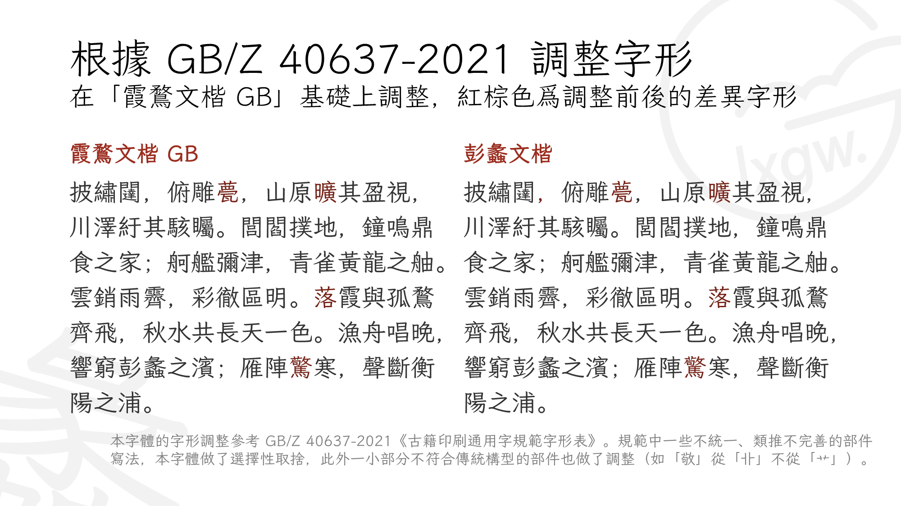
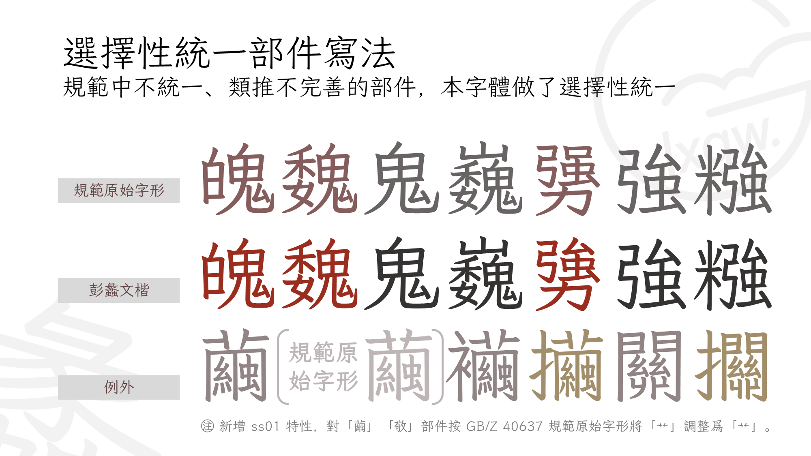
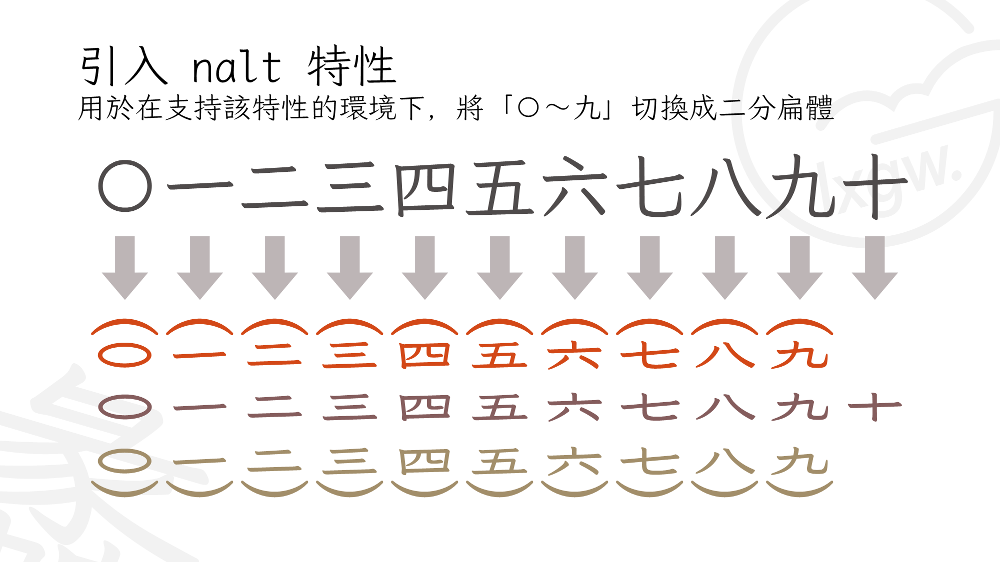
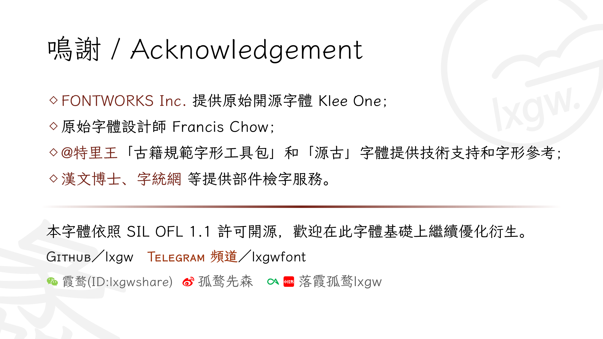

# 彭蠡文楷 / Pengli WenKai
基於《霞鶩文楷》系列字體衍生，參考《古籍印刷通用字規範字形表》（GB/Z 40637-2021）收字和調整字形的開源字體。
## 簡介
《彭蠡文楷》是基於《霞鶩文楷》系列字體衍生，根據《古籍印刷通用字規範字形表》（GB/Z 40637-2021）調整字形的開源字體，是 Fontworks（現日本蒙納株式會社，Monotype K.K.）所發佈的開源字體 [Klee One](https://github.com/fontworks-fonts/Klee) 的三次衍生字體。

《古籍印刷通用字規範字形表》（GB/Z 40637-2021）是新中國成立以來第一次對傳世古籍印刷字的第一次整理規範，也是中國大陸第一部正式針對繁體字制定的字形規範。這部指導性技術文件聲稱「適用於傳世古籍的印刷出版，以及現代書刊的繁體版印刷」，共收錄了 14,250 個漢字字形，並提供每個字的首音和 ISO/IEC 10646 編碼。《彭蠡文楷》在[《霞鶩文楷 GB》](https://github.com/lxgw/LxgwWenkaiGB)的基礎上，收錄 GB/Z 40637-2021 範圍内的全部漢字，參考 GB/Z 40637-2021 所規定的字形進行調整，並對該規範中不統一、類推不完善的部件寫法進行取捨。但願這一開源字體項目，能爲《古籍印刷通用字規範字形表》頒佈後的實踐貢獻一份綿薄之力，爲古籍印刷字體提供一種新的選擇。

字體名稱中的「彭蠡」一詞出自〔唐〕王勃《滕王閣序》中「漁舟唱晚，響窮彭蠡之濱；雁陣驚寒，聲斷衡陽之浦」一句。「彭蠡」爲中國第一大淡水湖⸺鄱陽湖的古稱（此外也曾作爲巢湖的古稱）。因「彭蠡」二字簡繁無差，且與上游字體《霞鶩文楷》字體名稱中的「霞鶩」二字一同出自《滕王閣序》，故本字體項目採用「彭蠡」作爲名號。

「彭蠡文楷」支持 Unicode 變體序列（Unicode Variation Sequences, UVS），用於標點符號寬度和位置的選擇，[點擊此處查看一覽表](documentation/uvs.pdf)。
### 字彙
- GB/Z 40637-2021 所收錄的 14,250 個漢字，用於「傳世古籍」所需漢字的排版與顯示；
- GB/T 12345-1990 所收錄的 6,866 個漢字，用於「現代書刊的繁體版本」所需漢字的排版與顯示；
- Unicode 康熙部首區段所收錄的 214 個部首字符，參考《康熙字典》總目中的部首字形進行取捨調整；
- 全半角 ASCII、拉丁補充-1 區、拉丁擴展 A 區、拉丁擴展 B 區、國際音標擴展區、拉丁附加擴展區、注音符號；
- 現代標點符號，以及古代漢語勾乙號「𖿢」、重文號「𖿣」；
- 易經、太玄經、算籌、中國象棋、中國傳統圓形吉祥圖案等符號；
- 用於古籍頁碼排版的二分扁體漢數字「〇～九」，通過 `nalt` 特性調用。
## 預覽

## 獲取字體
1. 進入 [Releases](https://github.com/lxgw/pengli/releases) 頁面下載 TTF 格式字體文件。
2. 本項目倉庫「FCP」文件夾中提供 FCP 格式的[字體工程文件](FCP/pengli.fcp)，便於二次開發字體。需要 14.0.0.2901 及更高版本的 FontCreator。
## 注意事項
1. 本字體根據 GB/Z 40637-2021（下稱「規範」）所規定的字形進行調整，但對於該規範中不同寫法的同一部件，本字體有選擇性地進行了統一（如「魄」「魏」的「鬼」部件、「勥」的「強」部件，寫法分别與其他含有「鬼」「強」的字統一）。此外，規範中的一小部分不符合傳統構型的部件在本字體中也做了調整，如「繭」「敬」在規範中的字形從「艹」，本字體改成了從「卝」的寫法。
2. 規範中有一個字的字形與編碼並未能很好對應：規範中收錄的字形是「𣜧（⿰木煢）」，其碼位應是 U+23727，但規範中給的卻是「橩`U+6A69`」的編碼，而 U+6A69 在 Unicode 碼表中各源的字形均爲「⿰木焭」。對於這種情况，本字體在按照規範將 U+6A69 做成「⿰木煢」形的同時，增加 U+23727 的碼位映射。此外，規範中收錄了「𨙬`U+2866C`」，但在基本區中有該字的同形重複字「邔`U+9094`」規範没有收錄，本字體亦對該字形設置了雙重映射。
3. GB/Z 40637 主要針對古籍用字，雖然聲稱「適用於現代書刊的繁體版印刷」，但對於近現代白話文中一些常用的字卻並没有收錄。考慮到 GB/T 12345 作爲 GB/T 2312 對應的繁體字編碼標準，也算是古籍規範制定前所謂「國標繁體」（或稱「大陸繁體」）的「依據」之一，本字體將 GB/T 12345 範圍内的字也一併收錄，作爲古籍字表中部分現代漢語常用字缺字的補償，古籍字表中的部件規則也類推到增補的字形中（但「源規格分離」的字形仍然保留原寫法，如「横」「溉」「録」的字形不替換成「橫」「漑」「錄」）。
4. 本字體不收錄簡化字，也不收錄除拉丁、漢字和注音符號以外的其他文種（如日文假名等）。
5. 本字體只提供單字重，没有製作多字重的計劃，個人認爲利用機械加粗或減細的方法實現多字重意義不大，且徒增維護負擔。
## 授權信息
本字體在 FONTWORKS 開發並發佈的 [Klee](https://github.com/fontworks-fonts/Klee) 開源項目基礎上改造，採用 [SIL Open Font License 1.1](https://openfontlicense.org) 授權許可。Klee 是 FONTWORKS 的商標。
> [Florence 弗羅侖司](http://florenceko.me/)提供 SIL Open Font License 1.1 非官方[全文中文翻譯](http://florenceko.me/?p=2089)及[解讀](http://florenceko.me/?p=2122)供參考。[猫啃網](https://www.maoken.com/)亦提供 SIL Open Font License 1.1 非官方[簡體中文譯本](https://www.maoken.com/ofl)。
### 許可
- 這款字體無論是個人還是企業都可以自由商用，無需付費，也無需知會或者標明原作者。 *（但如果告知，我會很感激。）*
- 這款字體可以自由傳播、分享，或者將字體安裝於硬件系統、嵌入於軟件或 APP 也是允許的，可以與任何軟件捆綁再分發以及／或一併銷售。
- 這款字體可以自由修改、改造，製作衍生字體。修改或改造後的字體也必須同樣以 [SIL OFL](https://openfontlicense.org) 公開。
### 限制
- 根據 [SIL Open Font License 1.1](https://openfontlicense.org) 「許可與條件」中第 1 條的規定， **禁止單獨出售字文件(OTF/TTF文件)的行爲。**
- 該字體不可在 [SIL Open Font License 1.1](https://openfontlicense.org) 以外的授權許可下發行。
## 鳴謝
- [日本蒙納株式會社](http://fontworks.co.jp) 提供原版開源字體； [開發者 GitHub 主頁](https://github.com/fontworks-fonts/)
- 原始字體的設計師周建豪（Francis Chow）先生；
- [特里王「古籍規範字形工具包」及「源古」系列字體](https://zhuanlan.zhihu.com/p/1897044158293717296)提供技術支持和字形參考；
- [@Steve-Yuu](https://github.com/Steve-Yuu) 等協助完善字型；
- 部分部件或整體字形借用 [芫荽 / Iansui](https://github.com/ButTaiwan/iansui)、[芫茜雅楷 / JyunsaiKaai](https://github.com/ItMarki/jyunsaikaai) 或 [Y 式筆書體](https://github.com/Steve-Yuu/YshiPen-Shuti)；
- 古漢語標點符號、吉祥圖案在 [煮豆黑體](https://github.com/Buernia/Zhudou-Sans) 基礎上衍生。

## 相關資料
- [GB/Z 40637-2021 古籍印刷通用字規範字形表](https://openstd.samr.gov.cn/bzgk/std/newGbInfo?hcno=52E2DE28D439C1937EE09AE4B5AA615B)
- [GB/T 12345-1990 信息交換用漢字編碼字符集 輔助集](https://openstd.samr.gov.cn/bzgk/gb/newGbInfo?hcno=90394D2B4115D9291C825A7651AEFE4B)
